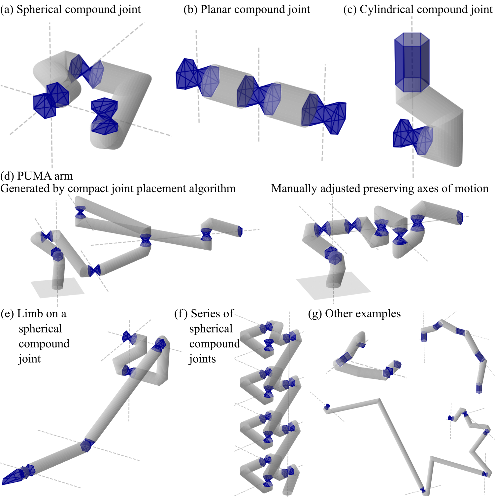
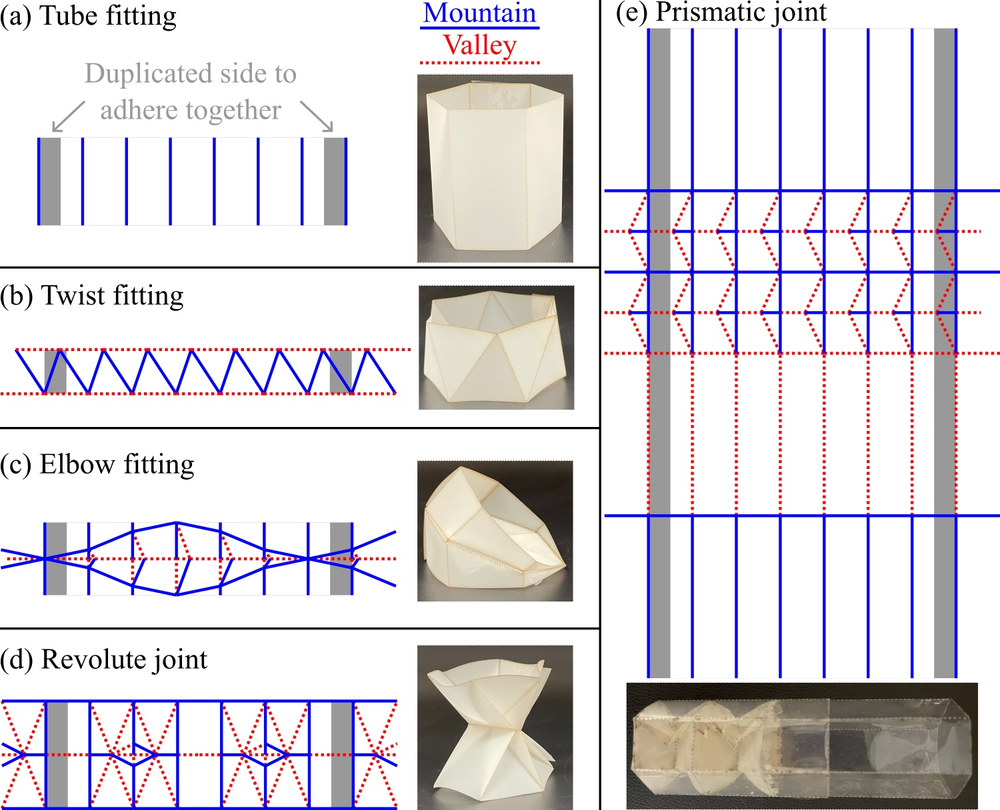
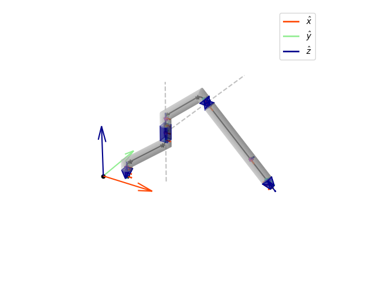
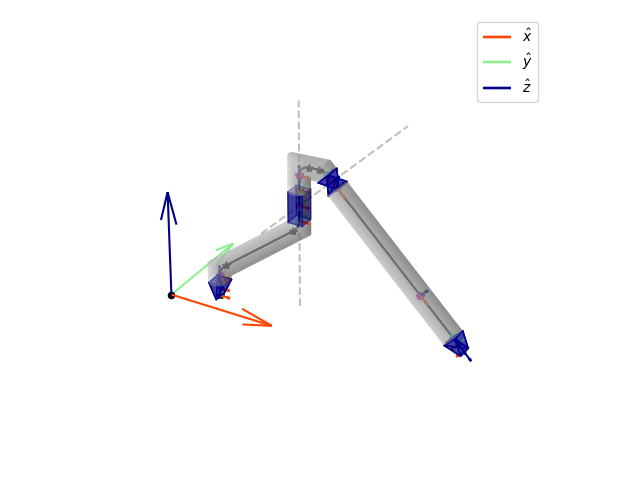
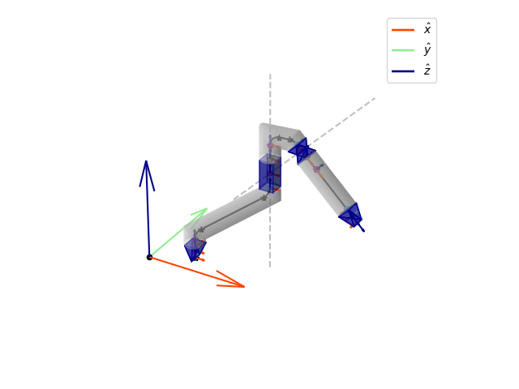
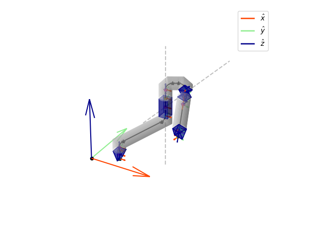
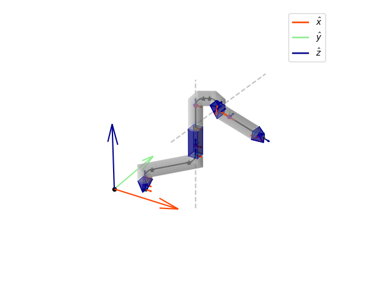
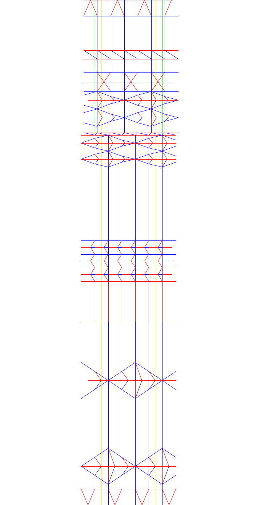

# KinegamiPython
[](https://github.com/bdaiinstitute/spatialmath-python)

Daniel A. Feshbach, Wei-Hsi Chen, Daniel E. Koditschek, Cynthia R. Sung. “Kinegami: Open-source Software for Creating Kinematic Chains from Tubular Origami.” In Origami 8: Eigth International Meeting on Origami in Science, Mathematics and Education, 2024 (forthcoming).

This is a python repository for creating and modifying kinematic chains made of tubular origami. Examples of its usage can be found in the examples folder. 
It requires the following libraries:
- numpy
- scipy
- matplotlib
- roboticstoolbox-python
- ezdxf
We developed and tested this code in python 3.12.

Note: when installing roboticstoolbox-python, you may get an error message saying it failed to build the wheel and prompting you to download Microsoft Visual C++ tools. Follow the provided link and download this: then you may need to restart your computer before re-attempting pip install roboticstoolbox-python

Abstract: Arms, legs, and fingers of animals and robots are all examples of “kinematic chains” - mechanisms with sequences of joints connected by rigid links. Lightweight kinematic chains can be manufactured quickly and cheaply using origami patterns rolled up into tubes. In recent work [[Chen et al. 22](https://repository.upenn.edu/entities/publication/66231fb3-9120-40e0-87c8-0d4f5c058983)], we demonstrated that origami patterns for kinematic chains with arbitrary numbers of degrees of freedom can be constructed algorithmically from a minimal kinematic specification (the axes that joints rotate about or translate along). The work was founded on a catalog of tubular crease patterns for revolute joints (rotation about an axis), prismatic joints (translation along an axis), and links, which compose together to form kinematic chains. In this paper, we implement these patterns and algorithms in python as a user-friendly, open-source tool for creating kinematic chains out of origami with little origami design expertise. Users can specify each joint by its axis only or by its full location and orientation. Our software uses this information to construct a single crease pattern for the corresponding chain. The software also includes a visualization tool so users can check that the chain can achieve their desired configurations, and methods to try modifications of an existing chain. This paper provides a detailed explanation of the code and its usage, including an explanation of our proposed representation for tubular crease patterns. We include a number of examples to illustrate the software’s capabilities and potential for robot and mechanism design.

## System Overview and Definitions
This code enables users to create kinematic chains made of tubular origami. The chains have revolute and prismatic joints connected by links following CSC Dubins paths. To iteratively construct a chain, users append each joint either by specifying its exact pose or by specifying only its axis of motion and letting an algorithm place the joint along the axis. Users can input poses and axes either in global coordinates or relative to the previous joint's pose. Additionally, users can modify existing chains by moving or deleting joints. Joint movements can be given as translations along the axis of motion, rotations about the axis of motion, or arbitrary rigid transformations. Joint movements can be set either to propagate to all subsequent joints or to apply only to the given joint. 

If a proposed modification cannot generate feasible link paths, the system will reject the change and warn the user. When a user has a candidate design, they can specify the state of each joint to visualize different configurations of the chain, letting them check whether it can do what they want and modify the design accordingly. Here are some example chains visualized in our system (the code for these is in the `examples/` folder):



### Kinegami Chains and Configurations
[[Chen et al. 22](https://repository.upenn.edu/entities/publication/66231fb3-9120-40e0-87c8-0d4f5c058983)] defined a catoalog of tubular origami modules, shown below instantiated on the hexagonal prism. (The fabricated examples are folded from Polyethylene terephthalate (PET) plastic with creases etched by laser-cut dots. The tubular wraparound is adhered with tape. The prismatic joint example is folded from clear PET with the inner REBO structure painted white for visibility.)


A link in a kinegami chain is a pair of elbow fitting modules joined by a tube, with a twist if necessary for alignment. Since elbows instantiate rotation equivalent to an arc with the same radius as the tube, a link instantiates a CSC Dubins path (degenerate cases can occur in which one or more of the path sections is empty and thus the corresponding origami modules are omitted). To avoid self-intersection within a link, we do not use C components with turning angle >π.

The revolute joint is a pair of triangular-prism-like polyhedra joined along the axis of rotation. The prismatic joint is a [REBO pattern](https://ieeexplore.ieee.org/document/8977315?source=authoralert) with a surrounding cylinder to prevent off-axis bending. Both joint types are compliant (see [[Chen et al. 22](https://repository.upenn.edu/entities/publication/66231fb3-9120-40e0-87c8-0d4f5c058983)] for energy analysis). The *state* of a joint is a real number indicating its current displacement (rotation in radians for revolute joints, translation for prismatic joints) from the minimum-energy state (state 0). The *joint pose* of a joint in a chain is located at the center of the joint's physical structure (at state 0), and its **z** direction is the axis of motion. Note that our prismatic joints connect to links along their axis of motion, while our revolute joints connect to links orthogonally to the axis of motion. Therefore, we define a joint's *path direction* as the end tangent of the incoming link path: for prismatic joints this is **z**, and for revolute joints this is **x**.

For each joint we also define *proximal* and *distal* frames where they connect to the incoming and outgoing links respectively. The proximal frame has orientation matching that of the joint pose, and it is fixed relative to the joint pose. In contrast, the distal frame's position (and for revolute joints, orientation) relative to the joint pose depends on the joint's current state. 

A *configuration* of a *k*-joint chain is a *k*-dimensional vector storing the state of each joint. It is important to distinguish the chain's configuration from its structural design: different configurations do not vary the link shapes, and therefore cannot alter the relative pose of each joint in its predecessor's distal frame.

### Joint Placement Algorithm Overview
Since the kinematic behavior of revolute or prismatic joints is given by their axes of motion, we say revolute or prismatic joints of the same type with the same axis of motion are *kinematically equivalent*, and the kinematics of a chain is specified only by its sequence of axes of motion. We have two algorithms to construct tubular chains given a sequence of axes: a *safe* algorithm and a relatively *compact* algorithm. The core idea is to convert the chain design problem into a path planning problem under the observation that each module has a centerline path and therefore can be considered as the instantiation of a rigid motion resulting in the appropriate transformation of the local frame of the chain. Since the tubular radius constrains the centerline path curvature, this is a Dubins planning problem. Links are constructed to instantiate CSC paths, so the joint placement algorithms solve for poses (along the given axes of motion) far enough apart that CSC paths exist linking the joints. The *compact* joint placement algorithm places a new joint at least 4*r* from the current chain's bounding sphere, and attaches it with a CSC path. However, such CSC paths may have turn angles >π which would cause collisions in our chain structures, so the alternate *safe* joint placement algorithm routes the chain through intermediate *waypoint* poses connected by CSC paths with turn angles ≤π. These waypoints often route the links along unnecessarily convoluted paths, which is why the first algorithm is called (relatively) "compact". However, even the compact algorithm often generates chains which can be made much shorter with human intuition moving joints along their axes, which is part of how the chain editing methods can be helpful.

## Code Structure Overview
The central class for users to interact with the code is `KinematicChain`, which inherits from `KinematicTree` (which is where most of the methods are defined). A chain stores a list of `Joint` objects, which each store their pose. When adding new joints, `KinematicChain` also computes links in the shape of [CSC Dubins Paths](https://en.wikipedia.org/wiki/Dubins_path), and stores them as a list of `LinkCSC` objects. `KinematicChain` has a `show` method for visualization. To make a chain, initialize it with a starting joint and then append further joints using the `append` method on `KinematicChain`. This method has options to place the new joint at its stored pose or to use a joint placement algorithm to find a pose on its axis of motion. You can also edit an existing `KinematicChain` by moving or deleting joints using the methods `translateJointAlongAxisOfMotion`, `rotateJointAboutAxisOfMotion`, `transformJoint`, and `delete`, and can change joint states using the `setJointState` method to visualize different configurations of the same chain. Once you are satisfied with a chain design, you can use the `creasePattern` method to compute its crease pattern as a `TubularPattern` object, which has its own methods to `show` a pattern or `save` it as a DXF.

### 3D Rigid Transformations
We represent 3D rigid transformations (and thus poses and reference frames) using the `SE3` class from [The Spatial Math Toolbox](https://github.com/bdaiinstitute/spatialmath-python/raw/master/.github/svg/sm_powered.min.svg). Useful constructors include `SE3()` for the identity transformation, `SE3.Trans(x,y,z)` for a translation, `SE3.Rx(angleInRadians)` for rotation about **x** (and similarly `SE3.Ry` and `SE3.Rz`), and `SE3(T)` where `T` is a 4x4 array encoding a (homogenous proper rigid) transformation matrix. Transformations are composed with the operator `@` and applied to vectors (represented by numpy arrays) with the operator `*`.

### Joints
We represent joints with an abstract base class `Joint` and subclasses for each specific joint type. `Joint` stores the joint's current `state` (a float, initialized to 0), its `Pose`, the tubular radius `r`, and its length `neutralLength` (the distance in state 0 between proximal and distal frames). It has an abstract method (a method implemented separately for each subclass) `pathIndex` specifying the path direction by returning an axis index (0 for **x** or 2 for **z**). There are four subclasses:
 - A `RevoluteJoint` is constructed from parameters `numSides`, tube radius `r`, angle `totalBendingAngle` (defining the range of states to be `[-totalBendingAngle/2, totalBendingAngle/2]`), and `Pose`. It also has an optional parameter `numSinkLayers` defaulting to 1, which can be increased to insert "recursive sink gadget" layers to its origami pattern that increase its stiffness. 
 - A `PrismaticJoint` is constructed from parameters `numSides`, `r`, `neutralLength`, `numLayers`, `coneAngle`, and `Pose`. The parameters `numLayers` and `coneAngle` (an angle in (π/6,π/2)) affect the joint's extension range and stiffness by controlling the number and internal angle of REBO pattern layers inside the joint.
 - A `Waypoint` is a pose that the path routes through. It has no physical structure or changeable state (i.e., its state range is {0}). The constructor parameters are `numSide`, `r`, `Pose`, and optionally `pathIndex` (defaults to 2 which represents **z**). 
 - `StartTip` and `EndTip` are static structures closing the beginning and end of a tube respectively. The constructor parameters are `numSides`, `r`, `Pose`, and `length`. Its path direction is **z**. It does not have changeable state, i.e., its state range is {0}. The pattern consists of half of the revolute joint pattern.

### Links
The `LinkCSC` class stores the radius, the start and end poses, and a CSC Dubins path connecting them. Since elbow fittings protrude increasingly outwards as the turn angle approaches π, we avoid excessively long elbows by replacing them with a concatenation of several shorter elbows. The `LinkCSC` constructor has an optional parameter `maxAnglePerElbow`, defaulting to π/2, to do this: 
when implementing a C component with turn angle 
θ >`maxAnglePerElbow`, 
it will concatenate *k*= ceil(θ/`maxAnglePerElbow`) elbow patterns each with turn angle θ/*k*.

### Chain Generation
The `KinematicChain` class stores on a list `Joints` of `Joint` objects and a list `Links` of `LinkCSC` objects. Specifically, `Links[i]` stores the link from the distal frame of joint `i-1` to the proximal frame of joint `i` (`Links[0]` is an empty path at the proximal frame of joint 0). `KinematicChain` also stores and maintains a `boundingBall` encompassing the whole structure. Chains are initialized with a given `startJoint`. The constructor also has optional parameter `maxAnglePerElbow`, defaulting to `np.pi/2`, which it uses when constructing links as described above.

Chains are constructed by repeatedly adding joints to the end of the chain with the `append` method (details below), for example (examples/example1.py):

```python
# Example 1A
from KinematicChain import *
r = 1
numSides = 4
chain = KinematicChain(StartTip(numSides, r, Pose=SE3.Trans(3,3,0), length=1.5)) 
prismatic = PrismaticJoint(numSides, r, neutralLength=3,
            numLayers=3, coneAngle=np.pi/4, Pose=SE3.Trans([5,5,0]))
prismaticIndex = chain.append(prismatic)
revolute = RevoluteJoint(numSides, r, np.pi, SE3.Ry(np.pi/4))
revoluteIndex = chain.append(revolute)
end = EndTip(numSides, r, Pose=SE3.Ry(np.pi/2), length=1.5)
endIndex = chain.append(end)
chain.show(showGlobalFrame=True)
```

The `show` method has a variety of optional parameters controlling which features are displayed and with what colors. Color and opacity default values are defined in `style.py`.

The `append` method takes parameter `newJoint` (a `Joint` object) and adds it to the end of the chain. It returns the index of the new joint. Depending on the following optional parameters, it will either use a joint placement algorithm (described above) to find the joint pose on its axis of motion (its **z** axis), or use `newJoint`'s pose exactly as given.
 - `relative`, defaulting to `True`, indicates whether `newJoint.Pose` should be interpreted as relative to the previous joint's frame (`True`) or as already in the global frame (`False`). `KinematicChain` stores joints in global coordinates, so if `relative=True` it converts the input from local to global coordinates.
    
 - `safe`, defaulting to `True`, indicates whether it should use the safe version of the joint placement algorithm. If `safe` is `False`, it will use the compact joint placement algorithm instead, unless `fixedPosition` is `True` in which case it does not algorithmically find joint placement at all.
    
 - `fixedPosition`, defaulting to `False`, indicates whether the joint should be placed exactly at the position in its given pose (`True`) or should use the joint placement algorithms to choose somewhere kinematically equivalent (i.e., along its **z** axis). This and `safe` cannot both be `True`.
    
 - `fixedOrientation`, defaulting to `False`, indicates whether the joint should be placed with exactly its given orientation (`True`) or with a kinematically equivalent orientation (i.e., rotated about its **z** axis) such that its **x** points along the common normal from the previous joint's **z** to the new joint's **z**. This choice is to match how frames are specified by [Denavit-Hartenberg parameters](https://en.wikipedia.org/wiki/Denavit%E2%80%93Hartenberg_parameters). This and `safe` cannot both be `True`.   

The safe algorithm is guaranteed to find a valid path to the new joint, but if `safe` is `False` it may fail to find a path. In this case it will print a warning and return `None`, leaving the chain unchanged. 

### Adjusting an Existing Chain
`KinematicChain` has several methods to edit existing joints:
 - `translateJointAlongAxisOfMotion` takes parameters `jointIndex` (int) and `distance` (float). 
 - `rotateJointAboutAxisOfMotion` takes parameters `jointIndex` and `angle` (radians).
 - `transformJoint` takes parameters `jointIndex` and `Transformation` (SE3).
 - `delete` removes joint `jointIndex` and recomputes links accordingly.
Each method returns whether it succeeded in finding new paths for the links: if it succeeds it edits the chain accordingly, and if it fails it leaves the chain unchanged and prints a warning. Each method has optional parameter `propogate`, defaulting to `True`, indicating whether to apply the same transformation to the rest of the chain (`True` case) or only to the given joint (`False` case).

Continuing the above example:
```python
# Example 1B
chain.translateJointAlongAxisOfMotion(revoluteIndex, -7)
chain.show(showGlobalFrame=True)
```


Kinematic-preserving methods `translateJointAlongAxisOfMotion` and `rotateJointAboutAxisOfMotion` each have an additional optional parameter `applyToPreviousWaypoint` defaulting to `False`. If set to `True`, this will check if joint `jointIndex-1` is a waypoint: if so, it will apply the same transformation matrix it applied to joint `jointIndex`.

```python
chain.translateJointAlongAxisOfMotion(endIndex, -10, applyToPreviousWaypoint=True)
chain.show(showGlobalFrame=True)
```


```python
chain.rotateJointAboutAxisOfMotion(revoluteIndex, -np.pi/3)
chain.show(showGlobalFrame=True)
```



```python
chain.translateJointAlongAxisOfMotion(prismaticIndex, -2, propogate=False)
chain.show(showGlobalFrame=True)
```


### Changing Joint States
The state of a joint in a `KinematicChain` can be adjusted by the chain method `setJointState`, which takes parameters `jointIndex` and `newState`. It will return whether this succeeded, i.e., whether `newState` is in the joint's valid state range  - and if it fails it will also print a warning. `Joint` has a `stateRange` method to help with this. Continuing from the above example:

```python
# Example 1C
minPrismaticState, maxPrismaticState = chain.Joints[prismaticIndex].stateRange()
chain.setJointState(prismaticIndex, maxPrismaticState)
chain.setJointState(revoluteIndex, np.pi/2)
chain.show(showGlobalFrame=True)
```


### Tubular Origami Pattern Generation
The method `creasePattern` on `KinematicChain` outputs the tubular origami crease pattern implementing the chain as a `TubularPattern` object. This class has a `show` method to plot and a `save` method to create a DXF file. To display the wraparound, it duplicates the starting panel (and all folds crossing it) along each end. This also creates area along which to adhere a flat sheet into a tube. From the above example:
```python
# Example 1D
pattern = chain.creasePattern()
pattern.save(dxfName="examplePatterns/example1.dxf")
pattern.show()
```


Red is valley folds, blue is mountain folds, yellow is the boundary of the pattern, green is the boundary extended outwards in each direction to have the first/last panel duplicated. We used a laser cutter to etch the folds and cut along the green boundary, then folded it into the desired chain:


